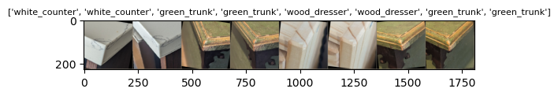
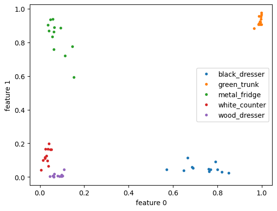
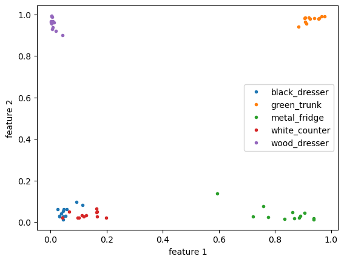

# About
This retrains a ImageNet to instead generate descriptors for images of corners.

The NN output descriptors are not labels, but some type of vector embedding.
Idealy the output values are similar for the same corner types and different
for different corners.

Corners features are useful in robotics for localization and mapping.
Generating a generic descriptor for differentiating between most corners.

By training neural network to differentiate between corners, 
instead of classify them, it will hopefully be able to deal with corner
types it has not been explictly trained on.


# TODO:
- [ ] Make final sigmoid part of the model as opposed to post processing step
- [ ] Evaluate on corner type that has never been seen before.
- [ ] Train with more corners

## Neural Network

## Labeling
Labeling was done with https://www.makesense.ai/ using point features places on corners

 CSV Format
 ```
 glass_table,859,2243,PXL_20240424_000735516.jpg,3072,4080
 ```
 ```
 label, x, y, img_filename, img_width, img_height
 ```

 ## Extracting
Small sections of label image are extracted and placed in separate folders for each label  

```
./extract_images.py nn_corners3.csv NNCorners3 out_data3
```


## NN Training
Instead of trying to have NN output a one-hot classification vector that matches
label, it is instead trained to output a descritor where images with same label
should get nearby descriptor, and images with different labels should be farther
away.

Because of how loss is calculated, the training must be done in batches of 2 or more.

## Batching
Images with the same label should have similar values.  However if there are many
image classes there will be a low probably of images with same label showing up in
a small batch size.

To deal with this problem, the LabelPairSampler is created so that it creates batches
with pairs images of that have the same label.

Below is a random sample batch, notice batch contains pairs for each corner type.



# Results
With only 5 corner types it is pretty easy for model to reach 100% accuracy on validation
dataset and training dataset.
Since training dataset has some randomization applied to it, there can be some runs that
producde different results.

The data set has 5 classes
 - wood_dresser
 - black_dresser
 - green_trunk
 - metal_fridge
 - white_counter

With descriptor 3 features that range from 0.0 to 1.0, there a effective 8 corners the
classes can be placed in.   The model does seem to put each feature in a different "corner"

Features descriptors
 - wood_dresser : 0,0,1
 - black_dresser : 1,0,0
 - green_trunk : 1,1,1
 - metal_fridge : 0,1,1
 - white_counter : 0,0,0





